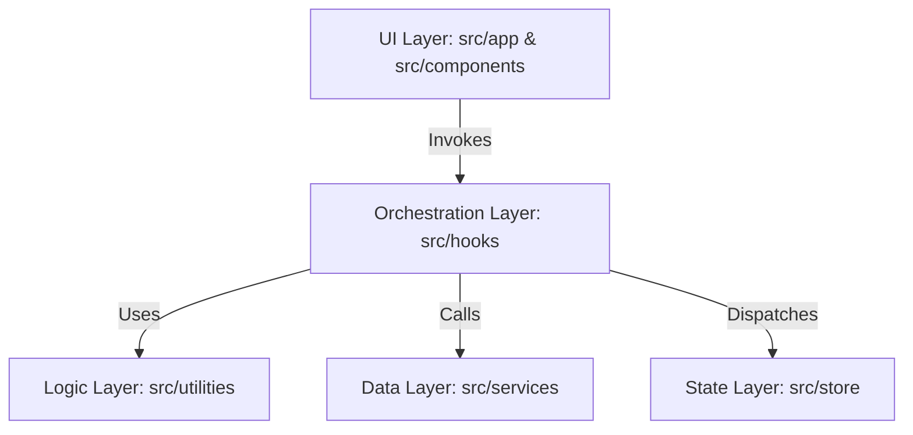

# 🎓 Mentovara — High-Performance EdTech Frontend

Mentovara is a premium, enterprise-grade learning management system frontend built with a **Zero-Logic Architecture**. It leverages **Next.js 16 (App Router)** and **React 19** to deliver a seamless, state-of-the-art educational experience.

---

## 🏗️ Architectural Excellence: Zero-Logic Pattern

The project is engineered for long-term maintainability by separating concerns into three strictly decoupled layers. This ensures that UI components remain "dumb" (rendering only), while business logic remains "pure" (testable JS).



### 🧱 Layer Breakdown
| Layer | Description | Rules |
| :--- | :--- | :--- |
| **Presentation** | `src/app` & `src/components` | No calculations. Use props and hooks only. |
| **Orchestration** | `src/hooks` | Manage React state, effects, and API orchestration. |
| **Pure Logic** | `src/utilities` | Pure JS functions for math, validation, and parsing. |
| **Data Access** | `src/services` | Axios configuration, interceptors, and endpoint mapping. |
| **Global State** | `src/store` | Redux Toolkit slices for cross-component data. |

---

## 🛡️ Key Features & Engineering Highlights

- **⚡ Next.js 16 & Turbo**: Utilizing the latest App Router patterns for optimized routing and layout persistence.
- **🎨 Tailwind CSS v4**: Ultra-modern, high-performance styling with zero-runtime overhead.
- **🔐 Advanced Auth**: Multi-role (Student/Instructor) flow with SMTP-based email verification and failed-request-queueing in Axios interceptors.
- **💸 Razorpay SDK**: Secure client-side payment orchestration with server-side signature verification.
- **📽️ Video Lifecycle**: Custom player with auto-save progress tracking and direct-to-backend video streaming to bypass serverless limits.
- **🧩 100% Component Modularity**: Complex page logic extracted into dedicated micro-components (`VideoUploadForm`, `CourseSidebar`) for supreme code readability.

---

## 📂 Targeted Directory Mapping

```text
client/
├── src/
│   ├── app/                # 🚀 ROUTES: Unified Next.js Pages & Layouts
│   │   ├── auth/           # Login, Register, & OTP Verification
│   │   ├── dashboard/      # Role-based secure views (Instructor/Student)
│   │   └── watch/          # Immersive Video Learning environment
│   ├── hooks/              # ⚓ HOOKS: 13 specialized hooks for state & logic
│   │   ├── useAuth.js      # Global Auth & Role orchestration
│   │   ├── useRazorpay.js  # Dynamic SDK loading & Payment flow
│   │   └── useWatchCourse.js# Video progress & synchronization
│   ├── utilities/          # 🧠 PURE LOGIC: Centralized Business Rules
│   │   ├── auth-utils.js   # Dynamic URL building & guard logic
│   │   ├── file-utils.js   # FormData orchestration & validation
│   │   └── index.js        # The official "Barrel File" for logic exports
│   ├── services/           # 🔌 SERVICES: API instance & Interceptors
│   ├── store/              # 📦 STATE: Redux Toolkit (Auth/Course domains)
│   └── lib/                # 🛠️ LOW-LEVEL: Design system primitives (CN)
└── proxy.js                # 🔄 PROXY: Integrated development API bridge
```

---

## ⚙️ Development Standard Operating Procedures (SOP)

### 1. Adding New Logic
**NEVER** write logic inside components.
1. Create a pure function in `src/utilities/<module>.js`.
2. Export it via `src/utilities/index.js`.
3. Consume it inside a hook or component.

### 2. API Communication
1. Define the endpoint string in `src/services/endpoints.js`.
2. Use the `api` instance from `src/services/api.js`.
3. Wrap the call in a custom hook inside `src/hooks/`.

### 3. State Updates
- For UI-only state: Use `useState` within a custom hook.
- For Global state (User/Enrollments): Use `dispatch` to `authSlice` or `courseSlice`.

---

## 🚀 Getting Started

1. **Install Dependencies**: `npm install`
2. **Setup Env**: Create `.env.local` using `NEXT_PUBLIC_BACKEND_URL`.
3. **Run Dev**: `npm run dev`
4. **Audit**: `npm run lint`

---
**License**: MIT | **Author**: Rustom Yadav
